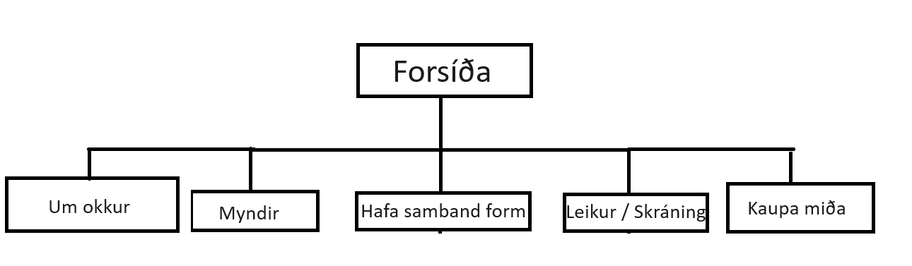
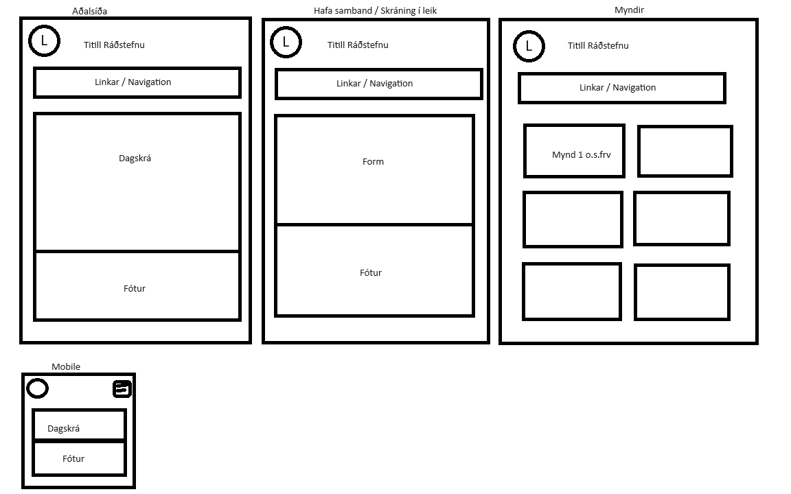
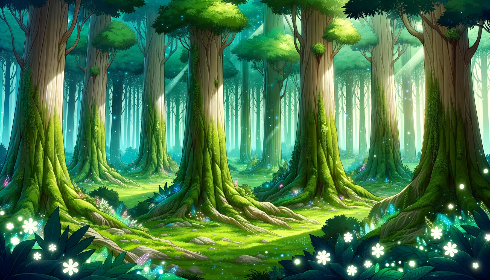
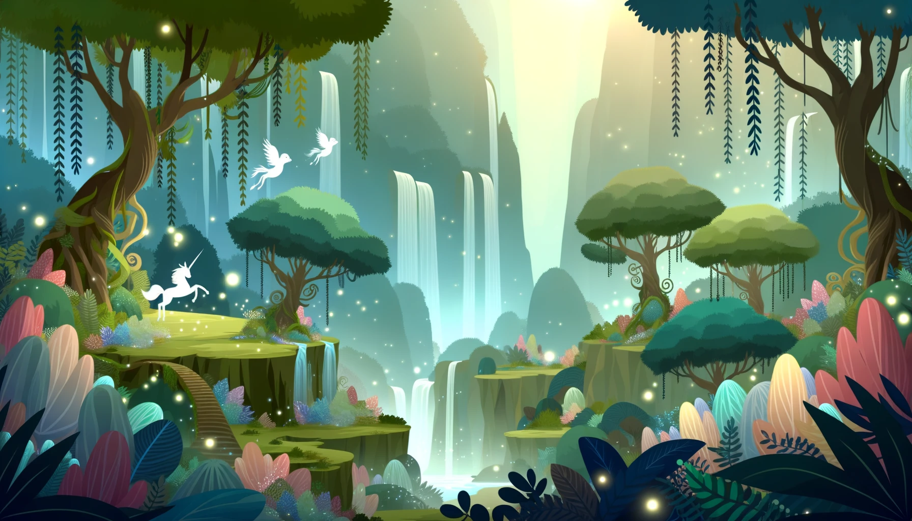
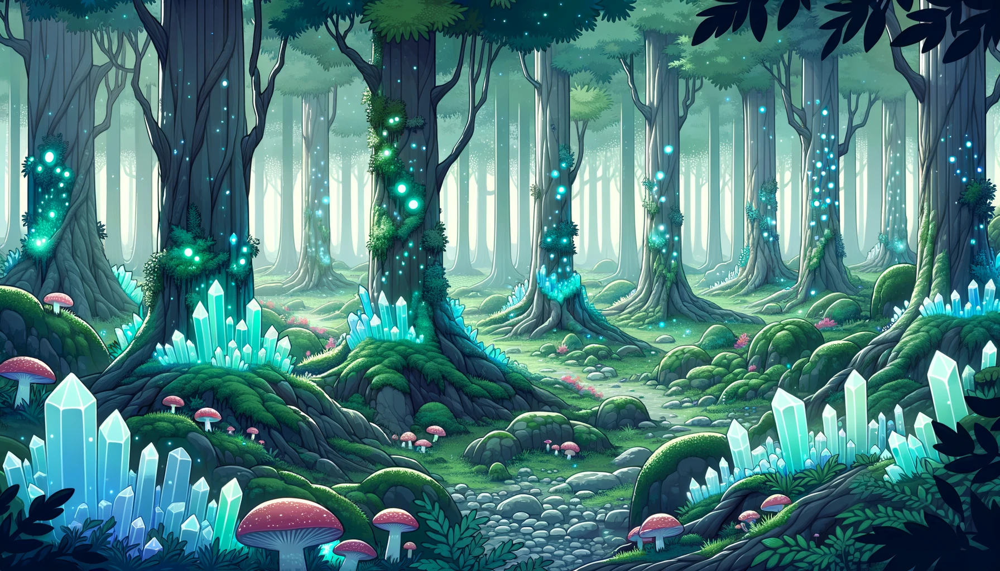
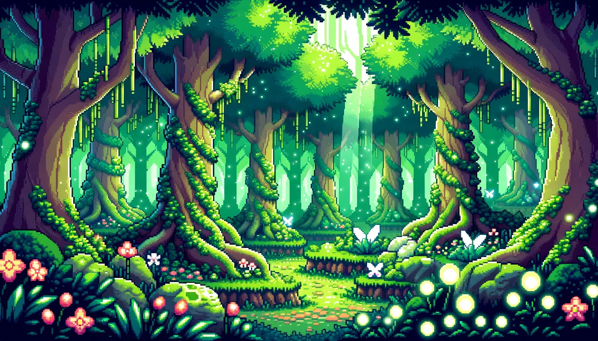
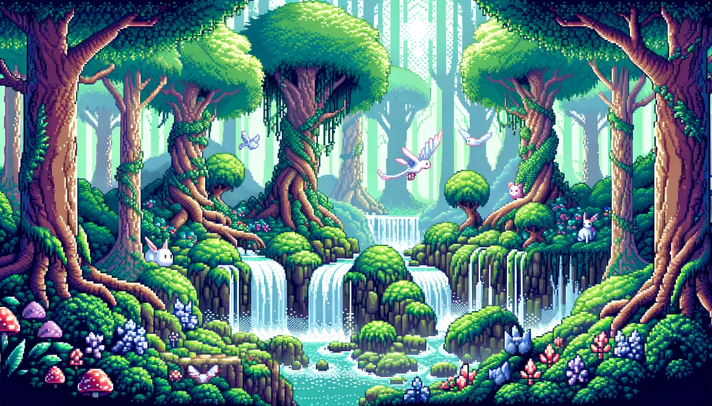
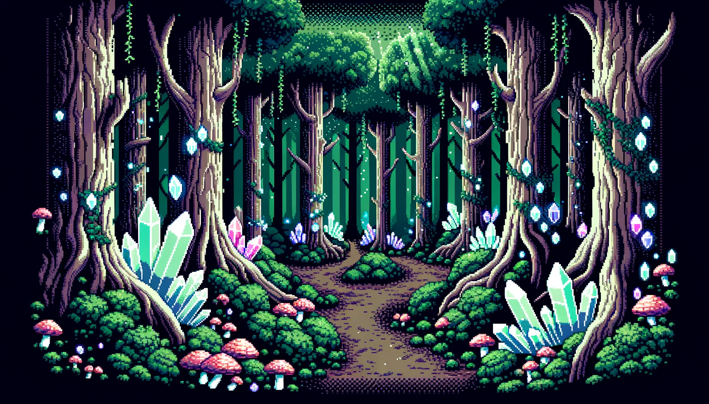
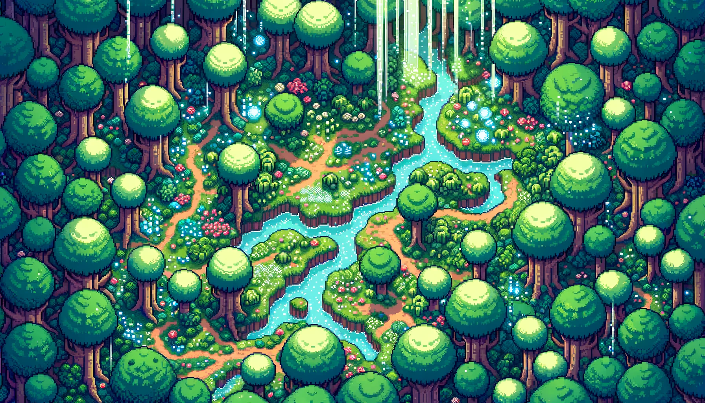

# Vefhönnun 2 - Verkefni 1 🌐

## Þema: Ráðstefna um tölvuteiknaðar myndir í RPG stíl 🧙

# Sitemap 📄

# Wireframe 🗺️

# Myndir 🖼️

# Lita og leturval 🎨

## Litaval ⚓

### Aðal litir 🏴‍☠️

1. **Aðal bakgrunnur**:  [`#F0F0F0`](https://www.color-hex.com/color/f0f0f0)
2. **Aðal texti**:  [`#333333`](https://www.color-hex.com/color/333333)
3. **Annar texti**:  [`#777777`](https://www.color-hex.com/color/777777)
4. **Áherslulitur 1**:  [`#00A4CC`](https://www.color-hex.com/color/00a4cc)
5. **Áherslulitur 2**:  [`#FFC300`](https://www.color-hex.com/color/ffc300)

### Aðrir litir 🏳️‍🌈

1. **Info**:  [`#007BFF`](https://www.color-hex.com/color/007bff)
2. **Success**:  [`#28A745`](https://www.color-hex.com/color/28a745)
3. **Warning**:  [`#FFC107`](https://www.color-hex.com/color/ffc107)
4. **Danger**:  [`#DC3545`](https://www.color-hex.com/color/dc3545)

## Leturval 📜

### Hausar 🏷️

- **Letur**: `'Georgia', serif`
- **Leturþykkt**: `bold`
- **Leturstærð**: `32px` fyrir H1, `28px` fyrir H2, ...

### Málsgreinar 📝

- **Letur**: `'Arial', sans-serif`
- **Leturþykkt**: `normal`
- **Leturstærð**: `16px`

### Vefslóðir ⛓️

- **Letur**: `'Courier New', monospace`
- **Leturþykkt**: `bold`
- **Font Size**: `16px`
- **Leturstærð**: `underline`

### Takkar 🖲️

- **Letur**: `'Verdana', sans-serif`
- **Leturþykkt**: `bold`
- **Leturstærð**: `18px`